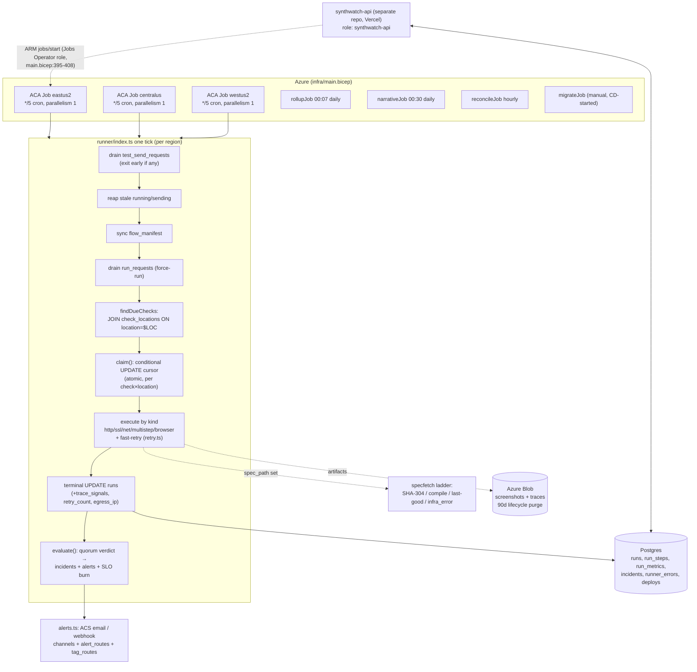

# SynthWatch Deep Review — July 2026 (docs-only analysis)

> **Status:** in progress (overnight run, sections committed incrementally).
> **Scope:** analysis only — no fixes applied. Every finding cites `file:line` or pasted
> command output. **OBSERVED** = ran it / read it here; **INFERRED** = deduced, with the
> falsification check named. Where a claim depends on external behavior (Node, Playwright,
> ACA, Postgres), it is verified against official docs, not memory, or listed in §7.
>
> **Recon result:** no prior committed analysis/review documents exist in this repo.
> `git log --all` shows prior sessions kept `ANALYSIS-*.md` as *gitignored scratch*
> (commit `1004396`, PR #174) — none were ever committed, so there is no baseline to
> diff against. This report is therefore a **fresh baseline**, not a NEW/CHANGED/STILL-OPEN
> delta. (OBSERVED: `.gitignore` ignores `ANALYSIS-*.md`; `git log --all --diff-filter=A`
> finds no `docs/analysis/**` history.)

## Contents

1. [System map as-observed](#1-system-map-as-observed)
2. [Schema stewardship audit](#2-schema-stewardship-audit)
3. [Code health](#3-code-health)
4. [Tech debt register](#4-tech-debt-register)
5. [Improvements + feature ideas](#5-improvements--feature-ideas)
6. [Boundary contracts](#6-boundary-contracts)
7. [Open questions + unverifiable](#7-open-questions--unverifiable)

---

## 1. System map as-observed

Everything in this section is **OBSERVED** from code/config in this repo unless marked otherwise.

### 1.1 Module structure

The repo has four functional areas (`README.md` + directory listing):

| Area | Contents | Evidence |
|---|---|---|
| `runner/` | The data-plane process (TypeScript, NodeNext ESM, Playwright). One entrypoint per concern: `index.ts` (check tick), `rollupMain.ts`, `narrativeMain.ts`, `reconcileMain.ts`, `redTestMain.ts` | `runner/package.json:11-18`; `runner/Dockerfile:28` (`CMD ["node","dist/index.js"]`) |
| `db/` | `schema.sql` (converged DDL), `migrations/0001…0057`, `migrate.sh`, `Dockerfile.migrate`, `ops/` (coordinated cutover scripts), `seed.sql` | `db/migrate.sh:1-24`; `db/Dockerfile.migrate:1-12` |
| `infra/` | One Bicep template declaring all Azure resources: 3 regional runner Jobs + migrate/rollup/narrative/reconcile Jobs, Postgres, Storage, Log Analytics, ACR, managed identity | `infra/main.bicep:444,609,765,902,970,1047,1153` |
| `scripts/` | `deploy.sh` (777-line manual deploy orchestrator) + `lib/deploy-lib.sh`, parity checkers, egress probe | `scripts/deploy.sh`, `scripts/lib/deploy-lib.sh` |

The dashboard/API is a **separate repo** (`synthwatch-api`, Next.js on Vercel — README "Decision 8"); it shares this repo's database. This repo owns the schema and all migrations (`.github/workflows/test.yml:6-8`: "The runner OWNS the schema + extraction logic + migrations — the most load-bearing repo").

### 1.2 Scheduler / dispatch flow (the three regional envs)

**Topology (OBSERVED from `infra/main.bicep`):** three identical ACA scheduled Jobs, one per region, all `cronExpression: '*/5 * * * *'`, `parallelism: 1`, `replicaTimeout: 240`, `replicaRetryLimit: 0` — primary eastus2 (`main.bicep:444-461`), centralus (`main.bicep:609-626`), westus2 (`main.bicep:765-782`). Each job differs only in region + `SYNTHWATCH_LOCATION` env (`main.bicep:525-526`). Regions were activated over time: `0014` (runs.location + min_fail_locations), `0020` (locations registry), `0022` (centralus cursors), `db/ops/relabel_default_to_eastus2.sql` (cutover relabel), `db/ops/assign_westus2_quorum.sql` (2-of-3 quorum activation; its comment says "Today all 9 checks are multi-region").

**Cadence lives in data, not cron** (README Decision 2): each check carries `interval_seconds` (default 300 — `db/schema.sql:66`) and a **per-(check, location) cursor** `check_locations.last_run_at`. The cron tier is just the finest tick.

**One tick's lifecycle** (`runner/index.ts:1-13` header, verified against the code):

1. **Test-send drain first** — API-triggered channel test-sends are DB rows; if any were processed the tick sends + exits, skipping checks (`index.ts:147-154`).
2. **Reap stale state** — `running` runs older than 30 min → `error` (`index.ts:200-211`), stale `sending` test-sends → `failed` (`index.ts:217-227`).
3. **Manifest sync** (best-effort, `index.ts:160`).
4. **On-demand "Run now" drain** — claims `run_requests` rows atomically (`UPDATE … WHERE status='pending'`, `index.ts:314-317`), dedups against an in-flight run (`index.ts:322-331`), force-claims and runs through the normal `runOne` path (`index.ts:333-355`).
5. **Due-filter** — `findDueChecks` INNER JOINs `check_locations` on `location = $SYNTHWATCH_LOCATION`: a check with no cursor for this region is *never selected* (enforced assignment, no lazy-insert — `index.ts:230-249`).
6. **Claim** — atomic conditional UPDATE of the (check_id, location) cursor, re-checking the due predicate; exactly one replica of one region wins; a `mirror` CTE keeps legacy `checks.last_run_at` in sync (`index.ts:262-284`).
7. **Execute** — by `check.kind`: http / ssl / dns / tcp / ping / multistep / browser (`index.ts:469-474`), wrapped in fast-retry (below).
8. **Evaluate** — cross-location verdict → debounced incidents → alerts → SLO burn check (`evaluate.ts:131-351`, `789-857`).

**Overlap / idempotency protection (OBSERVED):**
- Within a region: `parallelism: 1` (bicep) means overlapping replicas shouldn't occur; the conditional-UPDATE claim (`index.ts:262-284`) is the real guard and makes concurrent replicas race-safe anyway (README Decision 3).
- Across regions: cursors are keyed `(check_id, location)` (PK — `db/schema.sql:173-185`), so regions never contend.
- Incident open/resolve races across regions are handled by `ON CONFLICT (check_id) WHERE status='open' DO NOTHING` (`evaluate.ts:267-281`) and the conditional resolve UPDATE (`evaluate.ts:167-177`).
- A tick that overruns `replicaTimeout: 240`s is killed by ACA; the orphaned `running` row is reaped to `error` after 30 min (`index.ts:100-104, 200-211`), and `runOne` has a finalize-on-throw fallback (`index.ts:396-412`).

**Missed-tick behavior (OBSERVED + one INFERRED consequence):** the due predicate is age-based (`now() - last_run_at >= interval_seconds`), and claim sets the cursor to `now()`, not `last_run_at + interval` (`index.ts:266`). A missed/late ACA tick is simply absorbed: the check runs on the next tick, once — no backfill, no double-run. INFERRED consequence: the schedule is *drifting*, not fixed-rate — each late execution re-anchors the cadence (falsification check: read `claim()`; it sets `last_run_at = now()` unconditionally on win — confirmed). There is no drift test in the suite (searched `runner/*.test.ts`).

**Retry taxonomy (OBSERVED)** — five distinct mechanisms, in pipeline order (`db/migrations/0021_retries.sql:4-8`):

| # | Mechanism | Scope | Retries what | Evidence |
|---|---|---|---|---|
| 1 | Fast-retry (`runWithRetry`) | within one run | `error` AND `fail`; never pass/warn; fixed 5s backoff; last attempt is the verdict; prior attempt's run_steps/run_metrics/trace deleted between attempts; skipped when an incident is already open (`effectiveRetries`) | `retry.ts:16-50`; `index.ts:106-112, 450-490`; `0045` bumped default retries 1→2 |
| 2 | `failure_threshold` debounce + 2-of-3 quorum | across runs/locations | opens an incident only when ≥ effectiveN reporting locations each have their last N runs down; majority quorum `floor(n/2)+1` when `min_fail_locations` NULL | `evaluate.ts:387-446`; `quorum.test.ts:16-56`; `0045` defaulted threshold 3→1 |
| 3 | Spec-fetch fallback ladder | browser spec resolution | SHA-match reuse → recompile → last-known-good → non-paging `infra_error` (never throws into the run) | `specfetch/specCache.ts:138-192`; `index.ts:807-823` |
| 4 | Alert-level debounces | notifications | warn re-notify window (not stamped if ALL channels failed → retries next tick), RCA fire-once claim, SLO burn debounce | `evaluate.ts:532-580, 487-523, 789-857` |
| 5 | ACA replica retry | infra | `replicaRetryLimit: 0` for runner jobs (a crashed tick is just absorbed by the next cron); `1` for rollup/narrative/reconcile | `main.bicep:458,623,779,984,1061,1167` |

**Aux entrypoints (OBSERVED):** rollup daily 00:07 (`main.bicep:986`), narrative daily 00:30 (`main.bicep:1063`), reconcile hourly (`main.bicep:1169`) — all override the container CMD to their `dist/*Main.js`. `redTestMain.ts` is on-demand only, with **no ACA job resource** (grep of `main.bicep` — no match). The migrate job is `Manual`-trigger, run by CD before the image roll (`deploy.yml:79-110`) or by `scripts/deploy.sh:623,640`.

### 1.3 Config / secrets surface

Full inventory in the table below (every `process.env` read in `runner/`, cross-referenced with `infra/main.bicep` and `runner/.env.example`).

Secrets (bicep `secretRef`): `DATABASE_URL` (`db.ts:50`; bicep `:473,507`), `AZURE_STORAGE_CONNECTION_STRING` (`artifacts.ts:11`; bicep `:478`), `ACS_EMAIL_CONNECTION_STRING` (`alerts.ts:139`; bicep `:484,566`), `VERCEL_BYPASS_TOKEN` (`vercelBypass.ts:37`; bicep `:491,572` — host-scoped injection, deliberately not context-wide, `index.ts:850-867`). Non-secret env: `SYNTHWATCH_LOCATION`, `AZURE_OPENAI_*`, `AZURE_CLIENT_ID`, `ALERT_EMAIL_FROM`, `AZURE_STORAGE_CONTAINER`, `RCA_MAX_TOKENS`.

Findings (all OBSERVED):
- **Dead documented config:** `.env.example` documents `ALERT_EMAIL_TO` (`:21`), `ALERT_WEBHOOK_URL` (`:29`), `ALERT_WEBHOOK_AUTH_HEADER` (`:31`) — none is read anywhere; recipients/URLs now come from DB channel config (`alerts.ts:141,161,164`). Setting them silently does nothing.
- **Undocumented live config:** `SYNTHWATCH_LOCATION` (`index.ts:123`), `ALERT_TIMEOUT_MS` (`alerts.ts:26`), all `RCA_*` (`rca.ts:20-37`), `GITHUB_TOKEN`/`SYNTHWATCH_MONITORS_TOKEN` (`specfetch/fetchSpec.ts:42`), all `OTEL_*` (`otel.ts:74-84`) are absent from `.env.example`.
- **Template-unowned env:** `DASHBOARD_URL`, `ALERT_WEBHOOK_*`, `OTEL_*` are explicitly not bicep-owned (`main.bicep:575-578`) — a redeploy does not restore them (acknowledged in-template).
- **Deploy-time secrets** come from `~/.synthwatch.env` on the operator's machine (`scripts/deploy.sh:147-152`), passed inline as bicep params; the GitHub Actions deploy uses OIDC only, no DB password in CI (`deploy.yml:48-50, 76-78`).
- **Possible log leak (minor):** `otel.ts:92,135` logs the raw `OTEL_EXPORTER_OTLP_ENDPOINT`; a token embedded in that URL would land in ACA logs. `OTEL_EXPORTER_OTLP_HEADERS` (auth-bearing) is consumed implicitly by the SDK (`otel.ts:84` comment) and so escapes any env-var audit by grep.

### 1.4 Logging / telemetry paths

Four sinks (all OBSERVED):

1. **stdout → ACA Log Analytics.** ~20 bracketed channels (`[runner]`, `[trace]`, `[specfetch]`, `[metrics]`, `[rca]`, `[alerts]`, `[reconcile]`, …). Every invocation stamps a per-process `INVOCATION_ID` UUID on its first line (`index.ts:134`; `runnerErrors.ts:14-19`) so stdout ↔ DB rows reconcile.
2. **`runner_errors` table** (queryable fatal sink, migration 0050): `recordFatal(phase, err)` writes `{invocation_id, phase, check_id, run_id, message, stack}` best-effort with a 5s time-bound (`runnerErrors.ts:48-76`); global uncaught/unhandled handlers preserve exit-1 semantics (`runnerErrors.ts:83-90`; installed `index.ts:1023`). Phases in code: `main`, `due-loop`, `on-demand-loop`, `uncaughtException`, `unhandledRejection` (+ `deploy-marker` writes via `deploys.ts`). Note: 0050's comment documents only three of these.
3. **OTel side-channel** (opt-in): OTLP traces (root span per run + child span per step) and metrics (duration histogram, runs counter, up/down counter with bounded label set; `infra_error` excluded from up/down) — `otel.ts:195-287`; emitted after the run is already persisted (`index.ts:640-689`); shutdown flush bounded to 5s (`otel.ts:291-304`).
4. **Egress-IP capture** (static-egress-IP Phase 0): once per process, warmed at startup (`index.ts:137-138`), reflector list `checkip.amazonaws.com` → `api.ipify.org`, 3s timeout each, strict IP-shape validation, never throws → null (`egress.ts:14-45`); memoized incl. failure (`egress.ts:48-76`); stamped raw (deliberately not through the redactor — "our own infra's public IP", `index.ts:586-589`) into `runs.egress_ip` (migration 0054).

**Redaction application map** (who scrubs vs writes raw) — full analysis in §3.4; summary: scrubbing is a *sensitive-monitor-only* concern applied at `runs.error_message`, `run_steps.error_message` (both browser + multistep paths), and `trace_signals`; `runner_errors` and non-sensitive monitors persist raw text by design.

## 2. Schema stewardship audit

Method: a throwaway local Postgres 16 instance (this repo's target version — `db/schema.sql:1` header, `postgres:16` in `test.yml:41` and `Dockerfile.migrate:12`) was stood up **locally** (no remote connections), plus a throwaway SQL-extraction script over `runner/**/*.ts`. All results below are OBSERVED unless marked INFERRED.

### 2a. Grant coverage — mechanical cross-check (the missing-DELETE-grant class)

**Method (mechanical, re-runnable).** Instead of regex-parsing GRANT statements (which can't account for REVOKEs like 0041 or the DO-block role guards), the check applies the real artifacts and reads back *effective* privileges:

1. `CREATE ROLE "synthwatch-api" LOGIN` on a fresh local PG16.
2. Load `db/schema.sql`, then run `db/migrate.sh` (all 57 migrations apply — see §2d).
3. Dump `information_schema.role_table_grants` + `has_function_privilege()` per table/view/function.
4. Extract every SQL statement the runner executes: a script walks `runner/**/*.ts` (excluding node_modules/dist), captures every `` .query(`…`) `` template literal (122 statements found), and classifies verb×table (CTE-name aware).

**Result — effective grant matrix for `synthwatch-api` after schema.sql + 0001→0057** (local PG dump):

| Table | Effective grants | Runner verbs used (from the 122-statement extraction) |
|---|---|---|
| access_requests | DELETE, INSERT, SELECT | — |
| alert_profiles | **(NONE)** | — (legacy; routing replaced by channels/alert_routes, `evaluate.ts:127-129`) |
| alert_routes | S,I,U,D | SELECT |
| audit_log | INSERT, SELECT (U/D revoked — 0038:41-42) | — |
| channels | S,I,U,D | SELECT |
| check_locations | S,I,U,D | S,I,U,D |
| check_tags | S,I,U,D | S,I,D |
| **checks** | **(NONE)** | SELECT, UPDATE |
| daily_check_rollup | SELECT | INSERT (upsert), SELECT |
| deploys | SELECT | INSERT (upsert), SELECT |
| editors | S,I,D | — |
| **flow_manifest** | **(NONE)** | INSERT (upsert), DELETE |
| **incidents** | **(NONE)** | S,I,U |
| locations | S,I,U,D | SELECT |
| **maintenance_windows** | **(NONE)** | SELECT |
| otp_codes | S,I,U | — |
| reconcile_apply_plan | SELECT, UPDATE (0051 + 0053) | S,I,D |
| reconcile_drift | S,I,U,D | INSERT (upsert) |
| red_tests | SELECT | INSERT |
| report_narratives | SELECT | INSERT (upsert) |
| **run_metrics** | **(NONE)** | S,I,D |
| run_requests | INSERT, SELECT (0042 deliberate least-privilege) | SELECT, UPDATE |
| **run_steps** | **(NONE)** | S,I,U,D |
| **runner_errors** | **(NONE)** | INSERT |
| **runs** | **(NONE)** | S,I,U |
| sessions | S,I,U | — |
| spec_cache | SELECT only (0034 granted SIUD; **0041 revoked I/U/D** — the check is REVOKE-aware) | SELECT, INSERT (upsert) |
| spec_catalog | S,I,U,D | INSERT (upsert) |
| tag_routes | S,I,U,D | SELECT |
| test_send_requests | INSERT, SELECT (0026: runner owns transitions) | SELECT, UPDATE |
| Views: sla_availability_24h / 7d / 30d | **(NONE)** | — |
| View: sla_availability_90d | SELECT (0018) | — |
| Functions: sla_availability, slo_status, slo_burn_status | EXECUTE = true (PG default: EXECUTE to PUBLIC) | slo_burn_status called (`evaluate.ts:772-779`) |

(The runner itself connects as the server admin/owner role — `db.ts:49-51` uses `DATABASE_URL`, the same secret as the migrate job, and `0041:14` states "the runner (owner privileges are intrinsic, not grant-based — verified: synthadmin keeps write)" — so the runner's own verbs are never gated by these grants. The grant surface exists **for the API MI**.)

**Findings:**

- **F-2a-1 (Critical, systemic): there is no grant-coverage gate anywhere in this repo's CI.** `test.yml` seeds the test DB from `db/schema.sql`, which is deliberately CREATE-only — "grants to `synthwatch-api` are applied via migrations/ops, not here" (`test.yml:12-13`) — and CI never creates the role. So the exact class that shipped the production 500s (0044: missing DELETE on access_requests; 0053: missing UPDATE on reconcile_apply_plan) is structurally untestable today: a new table+API-endpoint pair with a missing verb cannot fail any check in this repo. *Falsification check run:* grepped all workflows, tests, and scripts for `has_table_privilege` / `role_table_grants` / grant assertions — zero hits outside migration comments.
- **F-2a-2 (Major): the baseline grants for the core tables are invisible to the repo.** `checks`, `runs`, `run_steps`, `run_metrics`, `incidents`, `maintenance_windows`, `flow_manifest` — tables the dashboard demonstrably needs (the API's create/update path drives `locations.ts` per its header comment; incidents/runs are the dashboard's whole content) — have **no migration-shipped grants at all** (matrix above). INFERRED: prod carries out-of-band grants and/or `ALTER DEFAULT PRIVILEGES` — evidenced by `0053:4`: "the `synthwatch-api` MI role got only SELECT **(via default privileges)**". This cannot be verified from the repo (no prod access in this session — §7), which is precisely the problem: the repo that owns the schema cannot state, let alone test, the API's real privilege set. Any table created by a NEW migration gets only whatever the invisible default privileges grant (per 0053: SELECT), so **every new write-path table is a latent 0044/0053 recurrence** until someone remembers an explicit GRANT.
- **F-2a-3 (Minor): asymmetric view grants.** `sla_availability_90d` gets SELECT (0018:24) but the sibling `sla_availability_24h/7d/30d` views get nothing from migrations. If the dashboard reads those (INFERRED — unverifiable here), they work only via the out-of-band baseline; if the baseline defaults don't cover *views* the pills would 500. Uncheckable from this repo → hypothesis, listed in §7.
- **F-2a-4 (Info): deliberate least-privilege rows are documented in-migration** (spec_cache 0041, run_requests 0042:38, audit_log 0038:41-42, test_send_requests 0026:36) — the audit can distinguish "deliberately absent" from "forgotten" only via these comments. That distinction should be code, not comments (see proposal).

**Proposal — permanent CI extension (grant-coverage gate).** The check above is fully mechanizable and cheap (~5s on top of the existing Postgres service job):

1. Commit `db/expected-grants.txt` — the table×verb matrix *including* a codified baseline for the core tables (this forces the out-of-band prod grants to be written down once; an ops script `db/ops/baseline_grants.sql` would make fresh installs converge too — today a fresh install has a **broken API** for checks/runs/incidents unless someone re-applies undocumented grants by hand).
2. In `test.yml`, before schema load: `CREATE ROLE "synthwatch-api"`. After `migrate.sh` (see §2d — the gate should exercise migrations, not schema.sql, for exactly this reason): dump `SELECT table_name, privilege_type FROM information_schema.role_table_grants WHERE grantee='synthwatch-api' ORDER BY 1,2` and `diff` against the expectations file. Any new table then *fails CI until a human writes an explicit grant decision* — deliberate-absence becomes an expectations-file entry instead of a comment.
3. (Cross-repo, follow-up) the API repo runs its integration tests connected **as** `synthwatch-api` rather than as owner — the only test that catches a missing verb end-to-end. Evidence this gap is real: `0044:8` — "integration tests connect as the owner role, so they can't catch a privilege gap".

### 2b. Index coverage — every runner query vs. every index

Method: the 122 extracted statements were filtered to the high-row tables and each WHERE/JOIN/ORDER BY column set was checked against `pg_indexes` from the migrated local DB (58 indexes total; full list captured during the audit).

**Covered well (no action):** `claim`/`findDueChecks` (PK `(check_id, location)` on check_locations); `countConsecutiveDown` (`runs_check_started_idx (check_id, started_at DESC)` + LIMIT — ideal); `burnRatesByLocation` and `slo_burn_status()` (check_id + started_at range — served by the same index); all `run_steps` reads (`run_steps_run_idx (run_id, step_index)`); `run_metrics` joins (`run_metrics_run_id_key`); `getOpenIncident` (partial unique `one_open_incident_per_check`); pending-queue scans (`run_requests_pending_idx`, `test_send_requests_pending_idx`, both partial on status='pending'); `deploys` seen-check (leading `target_host`).

**Flagged:**

- **F-2b-1 (Major — couples with F-2c-1): the incident verdict scans a check's *entire run history* on every single run.** `aggregateVerdict` (`evaluate.ts:414-446`) and, when down, `failingLocationNames` (`evaluate.ts:453-472`) both build a CTE over `runs WHERE check_id=$1 AND status NOT IN ('running','infra_error')` with **no time bound and no LIMIT**, then window-function over it to find each location's last `failure_threshold` runs. `runs_check_started_idx` makes it an index scan, but every tuple for that check is still read, per evaluation, i.e. on **every completed run**. Cost grows linearly with retained history; with no retention (F-2c-1) this is the primary query-latency time bomb — the arithmetic in §2c puts it at ~10⁸–10⁹ tuple-reads/day within a year on the configured `Standard_B1ms` burstable Postgres (`main.bicep:233`). A `started_at > now() - '1 day'` style bound (any window ≥ failure_threshold × interval × safety factor) or a per-location LIMIT would cap it.
- **F-2b-2 (Minor): `reapStaleRunning` seq-scans `runs` every tick.** `WHERE status = 'running' AND started_at < …` (`index.ts:201-208`) has no supporting index (`status` is unindexed; `runs_check_started_idx` leads with check_id). Runs every 5 min × 3 regions. A tiny partial index `ON runs (started_at) WHERE status = 'running'` (near-zero rows by definition) would make it O(stale-rows). Same shape: the run-now dedup probe (`index.ts:322-326`) is served by check_id, fine.
- **F-2b-3 (Minor): the daily rollup's day-discovery seq-scans `runs`.** `SELECT DISTINCT check_id, day FROM runs WHERE started_at >= $1 AND started_at < $2` (`rollup.ts`) — there is no index leading with `started_at`. Once daily (plus backfills), so tolerable, but it degrades with total table size, not window size. An index `ON runs (started_at)` fixes this and F-2b-2 partially overlaps.
- **F-2b-4 (Info): `incidents` narrative/rollup reads** filter `check_id + opened_at` range; `incidents_opened_idx` is `(opened_at DESC, id DESC)` without check_id (0032). Incidents stay low-row by design (debounced) — no action unless incident volume grows.

### 2c. Growth / retention

- **F-2c-1 (Critical): there is no retention/pruning mechanism for any per-run table.** OBSERVED: grep of all runner code and all migrations for `DELETE FROM runs|run_steps|run_metrics|runner_errors|red_tests|deploys|audit_log|otp_codes|sessions` finds only the fast-retry per-run cleanup (`index.ts:483-484` — deletes the *current* run's rows between attempts) and test fixtures. No cron job, no migration, no SQL function prunes history. The **only** retention in the system is the Azure Blob lifecycle rule (`main.bicep:343-370`): traces/screenshots expire after `artifactRetentionDays` (90d). The bicep comment even acknowledges the DB half is missing: "The DB still holds runs.trace_url/screenshot_url after deletion (a dangling reference … tracked as a follow-up)" (`main.bicep:334-336`). Meanwhile the redaction pull-back direction (store more: raw URLs #171/#172, per-run trace_signals 0040, spec_provenance 0047, egress_ip 0054, retry_count 0048) keeps *widening* the per-run row.
- **Row-growth arithmetic (OBSERVED inputs, stated assumptions):**
  - Inputs: 3 regions × `*/5` cron (`main.bicep:460,625,781`); "all 9 checks" are multi-region (`db/ops/assign_westus2_quorum.sql:11`); per-check `interval_seconds` in prod is DB state (unverifiable here — §7), so two bracketing scenarios using the repo's own defaults: schema default 300s (`schema.sql:66`) and the seed mix (`db/seed.sql`: 4×300s, 1×600s, 1×1800s, 1×3600s).
  - **runs:** worst case, 9 checks × (86 400/300) × 3 regions = **7 776 rows/day** (~2.84 M/yr). Seed-mix-like fleet: ≈ (6×288 + 1×144 + 1×48 + 1×24) × 3 ≈ **5 700 rows/day** (~2.1 M/yr). Fast-retry does not add rows (intermediate attempts are deleted).
  - **run_steps:** browser+multistep only. At seed-like cadence: browser 48 runs/day/region × ~5–15 steps + multistep 144 × #steps ≈ **1–3 k rows/day**.
  - **run_metrics:** 1 per browser run ≈ 150–900/day. **trace_signals:** jsonb *on the runs row* — every failure + ≤4 baseline refreshes/check/day (6 h throttle, `index.ts:114-118`); the golden fixture is 4.5 KB (`runner/test-fixtures/trace-signals-golden/expected.json`, 4 547 bytes) → single-digit MB/day worst case.
  - Net: **~2–3 M runs-rows/yr** — modest in bytes (low GB/yr), but F-2b-1 makes *query cost*, not storage, the binding constraint: per-check history H ≈ 850 rows/day (3 regions × 288); after one year H ≈ 310 k rows, read **twice per evaluation** when down, once when up, ≈ 7 776 evaluations/day → order 10⁹ tuple-reads/day on a `Standard_B1ms` (2 vCores burstable). INFERRED (falsification: needs prod EXPLAIN/latency data — §7) that this bites well before storage does.
- **Bounded-by-design tables (no concern):** `daily_check_rollup` (1 row/check/day, upsert), `deploys` (unique `(target_host, fingerprint)` — grows with real deploys), `spec_cache`/`spec_catalog` (per spec path), `flow_manifest` (per flow). `runner_errors`, `red_tests`, `audit_log`, `otp_codes`, `sessions` are event-driven and unbounded but low-rate; they still deserve inclusion in whatever retention policy lands.
- **Remediation shape (proposal, not applied):** a `retentionMain.ts` on the existing aux-job pattern (rollup/narrative/reconcile precedent) — e.g. delete `runs` (cascading `run_steps`/`run_metrics` — FKs are `ON DELETE CASCADE`, `schema.sql:279,300`) older than N days *after* they've been rolled into `daily_check_rollup`, and null-or-delete rows whose blob artifacts the 90 d lifecycle already deleted. The rollup table already preserves the long-horizon reporting series, so raw-run retention can be much shorter than 90 d for everything except open-incident forensics.

### 2d. Migration hygiene — bootstrap proven on a local Postgres 16

All three bootstrap paths were **actually run** (not inferred), on local PG16:

| Path | What | Result (OBSERVED) |
|---|---|---|
| A | `schema.sql` alone into an empty DB (what CI does) | ✅ loads clean with `ON_ERROR_STOP` |
| B | `migrate.sh` 0001→0057 into an **empty** DB | ❌ **fails at 0001**: `ERROR: relation "runs" does not exist`. `migrate.sh` exits non-zero (observed exit 3) and records nothing in `schema_migrations` (0 rows) — correct failure behavior, but the path itself is unsupported |
| C | `schema.sql` **then** `migrate.sh` (the documented baseline flow, `migrate.sh:17-21`) | ✅ all **57 applied**, only benign `already exists, skipping` NOTICEs |
| C′ | Re-run: `DELETE FROM schema_migrations`, `migrate.sh` again over the migrated DB (simulates the record-after-apply crash gap the header describes) | ✅ all 57 re-apply as no-ops — the idempotency contract (`migrate.sh:12-20`) holds for the *entire* chain, mechanically proven |

- **F-2d-1 (Major): fresh-database bootstrap is a two-artifact ritual with no guard.** Migrations are deltas that presuppose the base schema (Path B). The migrate ACA job (`main.bicep:902-919`) pointed at a truly fresh database fails mid-0001 — nothing checks "is this DB baselined?" first, and nothing in the repo *applies* schema.sql to prod-like environments (deploy.sh runs only the migrate job — `scripts/deploy.sh:623,640`). Fresh-install docs say "new installs converge from db/schema.sql" (every migration header), but no automation encodes it. Compounding: schema.sql carries zero grants (§2a), so even Path A+C yields a database where the API role can't read `checks`/`runs`/`incidents`.
- **F-2d-2 (Major): a stack-specific activation is baked into the migration chain.** `0022_centralus_registry.sql` INSERTs `centralus` into `locations` + a cursor per check. OBSERVED on the local bootstrap: fresh DB after Path C has `locations = {default:t, centralus:t}` while schema.sql alone yields `{default}`. 0022's own header says "centralus is THIS stack's activation, not a schema default" — but `migrate.sh` runs it on every fresh install, so any new deployment starts with a phantom second region enabled (its checks get centralus cursors that no runner will ever claim; harmless for paging **only** because `effectiveN` counts *reporting* locations, `evaluate.ts:387-391`). The westus2 activation was correctly kept in `db/ops/` — 0022 predates that convention and was grandfathered in.
- **F-2d-3 (Minor): schema.sql ↔ migrations functional convergence holds; comment drift only.** OBSERVED: `pg_dump -s` of Path A vs Path C, comments stripped, shows **no functional difference** — but the *raw* `slo_burn_status` function body differs in embedded comments (Path C's 0055 version carries the important `::text::float8` node-pg parity explanation; schema.sql's copy lacks it) and `COMMENT ON FUNCTION slo_status` texts differ. Cosmetic today; it means the two sources are hand-synced and nothing would catch a *functional* divergence. A CI step `diff <(pg_dump -s schema-only-db) <(pg_dump -s migrated-db)` (exactly what this audit ran) would freeze convergence permanently — cheap to add to the grant gate proposed in §2a.
- **F-2d-4 (Info): ordering + idempotency conventions hold.** Zero-padded 4-digit lexical ordering, no duplicate prefixes (`ls db/migrations` — 57 files, 0001–0057 contiguous). Every migration manages its own `BEGIN/COMMIT`; C′ proves whole-chain idempotency. `db/ops/*` scripts are correctly excluded from auto-apply and document their coordination requirements (`relabel_default_to_eastus2.sql:5-16` even documents the race with the lazy-insert era claim()).

## 3. Code health

### 3.1 Typecheck: current config vs. stricter flags (all OBSERVED, run locally)

Current config (`runner/tsconfig.json`: `strict: true`, NodeNext, ES2022): **`npx tsc --noEmit` → 0 errors.**

Delta with strict flags *not* currently enabled (each run individually over the same tree, which includes test files; "prod" excludes `*.test.ts`):

| Flag | Errors (all) | Errors (prod only) |
|---|---:|---:|
| `noUncheckedIndexedAccess` | 142 | 30 |
| `noPropertyAccessFromIndexSignature` | 171 | 146 |
| `exactOptionalPropertyTypes` | 7 | 4 |
| `noImplicitOverride`, `noFallthroughCasesInSwitch`, `noImplicitReturns`, `noUnusedLocals`, `noUnusedParameters` | 0 each | 0 each |
| **All combined** | **320** | — |

Reading: the codebase is already clean against the flow/dead-code flags. The `noUncheckedIndexedAccess` prod hits (top files: `alerts.ts` 10, `narrative.ts` 9, `multistep.ts` 4, `index.ts` 2) are the classically risky ones — unchecked `array[0]`/record-key access; `reconcile.test.ts` alone accounts for 59 of the test-side hits. `noUncheckedIndexedAccess` on prod code is a plausible S/M-sized hardening PR; `noPropertyAccessFromIndexSignature` is mostly stylistic churn.

### 3.2 Test suite + coverage (OBSERVED, run against a local PG16 seeded exactly like CI)

`npm test` equivalent with `--experimental-test-coverage`: **227/227 pass, 0 skipped, ~26 s** (CI's claim of "0 unguarded skips" reproduces; the suite includes the 6 DB-gated integration files).

Overall: **81.4 % line / 88.8 % branch / 86.5 % function.** But the distribution is what matters — coverage by prod file, weakest first:

| File | Line % | Note |
|---|---:|---|
| **`index.ts` (the dispatch/result-write path)** | **0 — absent from the coverage report entirely** (never imported by any test; the 45 % `index.js` in the table is `checks/index.js`, the flow loader) | The tick loop, `claim()`, `runOne`/`runOneInner` (terminal result-write, trace routing, redaction wiring, egress stamp), `executeBrowser` — the most load-bearing file in the repo has no direct test. Its logic is partially covered *indirectly* via extracted pure functions (`retry.ts`, `evaluate.ts` verdict fns) and the swallowed-errors integration test, but the assembly itself is untested. |
| also absent (0 %): `multistep.ts`, `netChecks.ts`, `sslCheck.ts`, `rollup.ts`, `narrative.ts`, `otel.ts`, `testSend.ts`, `flowManifest.ts`, `tags.ts`, `locations.ts`, `aoai.ts`, aux `*Main.ts` | 0 | Executors for 5 of 7 check kinds (ssl/dns/tcp/ping/multistep) and the whole rollup/narrative pipeline have zero coverage. |
| `httpCheck.ts` | 9.2 | The 6th executor — near-zero. |
| `alertEmail.ts` / `assertions.ts` | 13.9 / 18.1 | Alert rendering + the no-code assertion engine. |
| `rca.ts` / `artifacts.ts` | 33.6 / 34.2 | |
| `alerts.ts` | 49.3 | Channel resolution partially tested. |
| `evaluate.ts` | 73.0 | Uncovered ranges include `aggregateVerdict`'s SQL (`413-446`) and the incident open/resolve dispatch branches (`242-267`, `166-193`) — the quorum *pure functions* are well tested (`quorum.test.ts`) but the SQL they wrap is not. |
| `redact.ts` **100**, `traceSignals.ts` 98.5, `retry.ts` 100, `reconcile.ts` 95.3, `specfetch/*` 75–100 | | The redaction and trace_signals paths — the ones with golden-fixture parity stakes — are the *best*-covered. |

**Against the named critical paths:** redaction ✅ strong; trace_signals ✅ strong; **dispatch ❌ 0 %; result-write ❌ 0 %** (both live in `index.ts`). The pattern is consistent: logic extracted into pure modules is tested; the orchestration file that composes them is not.

### 3.3 Dependencies (OBSERVED)

`npm audit`: **0 vulnerabilities.** `npm outdated`: 7 packages, all patch/minor behind (`@azure/storage-blob` 12.32→12.33, `@types/node` 26.0→26.1, `adm-zip` 0.5.17→0.5.18, `eslint` 10.5→10.6, `globals` 17.6→17.7, `playwright` 1.61.0→1.61.1, `typescript-eslint` 8.61→8.62). Nothing major-version behind. The Playwright pin is version-locked to the Docker base image with an explicit bump-both comment (`Dockerfile:3-7` ↔ `package.json:33`, both 1.61.0) — drift here breaks browser launch, and there is no automated check that the two stay equal (Dependabot could bump the npm side alone; a one-line CI grep would close it).

### 3.4 Error-handling consistency audit (every catch path)

Full sweep of every `catch`/`.catch` in prod code. The dominant pattern is healthy and consistent: **fatal → `recordFatal` (runner_errors + stdout, 5 phases); non-fatal → `console.warn` with a bracketed channel and continue; monitor verdict errors → DB columns.** Two writers rethrow (manifest parse, txn wrappers). Findings:

- **F-3-1 (Minor): one truly silent catch.** `deploys.ts:107-109` — `noteDeployMarker` swallows *any* throw (including DB errors) with a comment and no log. Everything else that swallows either logs or is an intentional, documented fail-soft (egress reflectors, trace-zip parse, per-metric capture — the last is *observable* via `captureFailed` rather than logged).
- **F-3-2 (Major, redaction uniformity): the redaction system is applied at exactly three sinks — and provably not at the others.** Scrubbed (sensitive monitors): `runs.error_message` (`index.ts:516-519`), `run_steps.error_message` (browser `stepRecorder.ts:131`; multistep `multistep.ts:156`), `trace_signals` (`index.ts:543`). **Not scrubbed:**
  - `runner_errors.message`/`.stack` (`runnerErrors.ts:61-63`): `recordFatal` has the check/run context (`setErrorContext`) but never consults `check.sensitive` — an exception escaping a *sensitive* monitor's run (due-loop/on-demand-loop catch) persists the raw Playwright message + stack, which is exactly the text class B10 scrubs elsewhere (a native error can echo a Bearer/JWT — `index.ts:512-514`'s own rationale). This is the one persisted error-text sink where sensitive-derived text lands raw.
  - `runs.error_message` when status is `infra_error` (`index.ts:518` gates the scrub on `fail|error` only): the text embeds spec_path + monitors-repo fetch diagnostics (`index.ts:815`), not target-site secrets — low risk, but an unredacted-for-sensitive path by construction. `warn` messages are self-generated (no PII) — fine.
  - `test_send_requests.detail` (`testSend.ts:33-37,75-78`): carries raw dispatch errors that can embed channel config (webhook URL with token — `alerts.ts:158` acknowledges webhook URLs may embed tokens). Infra-config-sensitive rather than monitor-sensitive.
  - `reconcile_drift.detail` / `reconcile_apply_plan` blockedReason: raw monitors-repo compile/fetch text — low sensitivity, noted for completeness.
  - Verdict: redaction is **uniform across the monitor-data writers** (the B10 design surface) but was never extended to the *infra* error writers, one of which (`runner_errors`) demonstrably receives sensitive-monitor-derived exception text.
- **F-3-3 (Info):** `spec_cache` has no error column at all — fetch/compile failures are stdout-only, then degrade (`specCache.ts:108-125`); the drift row's `orphan.reason` is the only queryable residue.

### 3.5 spec_path-NULL class: systemic guard or per-instance fix?

**Verdict: systemic — four independent layers — with one real hole.** Layers: (1) DB constraint `browser_needs_flow` (`schema.sql:157-159`) + `checks_spec_path_shape` (0033, validates existing rows); (2) runtime backstop in `executeBrowser` — a browser check with neither spec_path nor flow_name returns a clean `error` outcome instead of crashing (`index.ts:841-843`); (3) reconcile plan gate — an unresolvable browser spec plans as `status:'blocked'` with zero statements (`reconcile.ts:611-634`, PR #156), and `buildApplyUpsert`/`buildChangedUpdate` always write a validated spec_path (self-heals NULL on re-apply, `reconcile.ts:399-445`); (4) one shared `assertValidSpecPath` used by runtime, reconcile, and mirrored by the DB CHECK (`fetchSpec.ts:28-32`).

- **F-3-4 (Major): `browser_needs_flow` exists only in `db/schema.sql` — no migration ever adds it.** OBSERVED: `grep -rn browser_needs_flow db/` matches only `schema.sql:158`. A database provisioned before that constraint (i.e. **the production database**, which converges via migrations) never acquires it; on such installs the DB layer enforces nothing and the whole class rests on the runtime backstop and the (currently dry-run-only) reconcile gate. Contrast 0033, which correctly shipped `checks_spec_path_shape` as an `ADD CONSTRAINT` migration. Falsification check run: searched all 57 migrations for the constraint name and its predicate — zero hits. A backfill migration (validate-then-add, with a pre-check for violating rows) closes it.
- **F-3-5 (Info):** the `index.ts:843` backstop itself has no direct test (asserted only implicitly); reconcile's blocked-gate is well tested (`reconcile.test.ts:524-534`).

## 4. Tech debt register

Ranked by (severity × blast radius) ÷ remediation cost. IDs reference §-findings above. Size: S ≤ ½ day, M ≤ 3 days, L > 3 days.

| ID | Area | Evidence | Severity | Blast radius | Proposed remediation | Size |
|---|---|---|---|---|---|---|
| TD-1 | DB grants: no CI gate + invisible baseline (F-2a-1/2) | `test.yml:12-13` (schema.sql is grant-free, role never created in CI); grant matrix §2a: core tables `(NONE)`; `0053:4` "via default privileges"; prior prod 500s 0044/0053 | **Critical** | Every future API write path is a latent prod 500 (the class already shipped twice and "survived five fix attempts"); fresh installs have a non-functional API | Codify baseline grants (`db/ops/baseline_grants.sql` + expectations file), add the §2a grant-diff CI step to `test.yml` | M |
| TD-2 | Unbounded per-run tables + unbounded verdict scan (F-2c-1, F-2b-1) | No DELETE/pruning anywhere (grep, §2c); `evaluate.ts:414-446, 453-472` CTEs have no time bound/LIMIT; blob purge is 90 d but DB rows immortal (`main.bicep:334-336` acknowledges the dangling half); `Standard_B1ms` (`main.bicep:233`) | **Critical** (time-bomb, not yet an outage) | Every run evaluation slows linearly with history; ~2–3 M rows/yr; incident latency + missed/late paging as the burstable DB saturates | (1) time-bound `aggregateVerdict` (any window ≥ threshold×interval×safety); (2) `retentionMain.ts` on the aux-job pattern pruning rolled-up runs (+ cascaded steps/metrics) and blob-orphaned URLs; (3) partial index `runs(started_at) WHERE status='running'` (F-2b-2) | M |
| TD-3 | CD rolls only 2 of 6 runner-image jobs | `deploy.yml:120-124` updates `synthwatch-runner-job` + centralus only; westus2/narrative/rollup/reconcile are absent; `deploy.sh:71-74` (RUNNER_IMAGE_JOBS) + `verify()` "BUG 2" comment prove all 6 are supposed to be on the same SHA — the manual script even exists *because* this class (migrate job stuck on old SHA) already bit | **Major** | After every merge, the westus2 **quorum** region and all three batch jobs run stale code until the next manual `deploy.sh`; cross-region code skew can disagree on verdict/redaction/schema expectations | Add the 4 missing `az containerapp job update` lines (westus2 + narrative + rollup + reconcile) to `deploy.yml`, mirroring `RUNNER_IMAGE_JOBS` | **S** |
| TD-4 | `browser_needs_flow` constraint never migrated (F-3-4) | Only `schema.sql:158`; zero matches in `db/migrations/` | Major | Prod DB (migration-converged) lacks the constraint; the spec_path-NULL class is one bad API/manual write away from recurring, guarded only by the runtime backstop | Backfill migration: pre-check violating rows, then `ALTER TABLE … ADD CONSTRAINT browser_needs_flow … ` (0033 is the template) | S |
| TD-5 | `runner_errors` persists raw sensitive-monitor exception text (F-3-2) | `runnerErrors.ts:61-63` no scrub; called from due-loop/on-demand-loop with errors escaping sensitive runs; B10's own rationale (`index.ts:512-514`) says this text class can embed Bearer/JWT | Major | Tokens/PII from cart/auth monitors queryable in `runner_errors` (which is deliberately long-lived + admin-visible) | In `recordFatal`, when `currentCheckId` resolves to a sensitive check (or cheaply: always) run message+stack through the built-in denylist redactor before persist | S |
| TD-6 | Dispatch/result-write path has zero test coverage (§3.2) | `index.ts` absent from coverage output; executors for 5/7 kinds 0 %; `httpCheck.ts` 9 % | Major | The file where all prior swallowed-error bugs (B1/B2/B5, #149-151, #162) lived is the one place a regression can't be caught; refactors of `runOne` are blind | Integration-test `runOne` against the existing PG harness with a stub executor (the swallowedErrors test is the seed pattern); add httpCheck/assertions unit tests | M/L |
| TD-7 | Fresh-DB bootstrap ritual: unguarded two-artifact ordering + stack leak (F-2d-1/2) | Path B fails at 0001 (observed); fresh Path C DB gets `centralus` enabled (observed, 0022) | Minor (single-stack today) | A future second install / DR rebuild hits a mid-0001 failure, then a phantom region; grants also missing (TD-1) | `migrate.sh`: pre-flight "base tables exist?" check with a pointed error; document the schema.sql→migrate→baseline-grants order in one runbook; keep future activations in `db/ops/` (westus2 convention) | S |
| TD-8 | Missing time-based index on `runs` (F-2b-3) + reap seq-scan (F-2b-2) | `rollup.ts` day-discovery range scan; `index.ts:201-208` status scan | Minor | Daily rollup + per-tick reap degrade with total table size | Covered by TD-2's index work (`runs(started_at)` + partial running index) | S |
| TD-9 | Strict-flag gaps: 30 prod `noUncheckedIndexedAccess` errors (§3.1) | tsc runs above; top: `alerts.ts` (10), `narrative.ts` (9) | Minor | Latent undefined-access bugs in alert routing/narrative paths | Enable flag, fix the 30 prod sites (tests can stay via per-file suppressions or a follow-up) | M |
| TD-10 | Config-surface drift: 3 dead documented vars, ~12 live undocumented vars, template-unowned env (§1.3) | `.env.example:21,29,31` dead; `SYNTHWATCH_LOCATION`/`RCA_*`/`OTEL_*` etc. undocumented; `main.bicep:575-578` | Minor | Operator sets a var that does nothing / redeploy silently loses out-of-band env | Regenerate `.env.example` from the §1.3 table; move `DASHBOARD_URL` (+ OTel set if adopted) into bicep params | S |
| TD-11 | Silent catch in deploy-marker path (F-3-1) | `deploys.ts:107-109` | Minor | Deploy-marker capture can die invisibly (feature silently stops producing data) | Add the standard `console.warn('[deploy-markers] …')` | S |
| TD-12 | schema.sql ↔ migrations convergence is hand-maintained (F-2d-3) | Comment drift observed in `slo_burn_status`; no CI diff | Minor | A functional divergence would ship silently; new installs and migrated installs diverge | Add the `pg_dump -s` diff step (mechanics proven in §2d) to the TD-1 CI job | S |
| TD-13 | `test_send_requests.detail` can persist channel config incl. webhook tokens (F-3-2d) | `testSend.ts:75-78`; `alerts.ts:158` acknowledges token-in-URL | Low | Infra token readable via a table the API can SELECT | Truncate is already there; add the denylist redactor to `finish()` | S |
| TD-14 | Playwright npm↔image pin has no drift check (§3.3) | `Dockerfile:3-7` "Bump BOTH together" is comment-enforced only | Low | A lone Dependabot bump breaks browser launch at runtime, not CI | One-line CI grep comparing `package.json` pin to the Dockerfile tag | S |

## 5. Improvements + feature ideas

Each item is grounded in something observed (a capability the data already supports, or a seam the code already has). Ranked by value/effort.

### 5.1 Ranked list

| # | Idea | Grounded in (OBSERVED) | Value | Effort |
|---|---|---|---|---|
| 1 | **Roll all 6 runner-image jobs in CD** (= TD-3) | `deploy.sh` already defines the exact job list (`RUNNER_IMAGE_JOBS`, `deploy.sh:72-74`) and verify() proves the invariant | Kills a standing cross-region skew after every merge | S |
| 2 | **Grant-coverage CI gate + baseline codification** (= TD-1, mechanics proven §2a) | The audit's own harness: role + schema + migrate + `role_table_grants` diff ran in ~5 s locally | Ends the recurring prod-500 class permanently | M |
| 3 | **Retention job + verdict time-bound** (= TD-2) | Aux-job seam exists (rollup/narrative/reconcile all follow the same `*Main.ts` + bicep job pattern); `daily_check_rollup` already preserves the reporting series; FKs already `ON DELETE CASCADE` (`schema.sql:279,300`) | Defuses the §2c time bomb before it pages | M |
| 4 | **"Degrading-but-green" (flaky-monitor) signal** | `runs.retry_count` is written on every run (`index.ts:596`) and `0048:9` explicitly names the query — `status='pass' AND retry_count>1` — but **nothing in this repo reads the column** (grep: write-only). The data for a "this monitor only passes on retry" warn/narrative fact already exists | Surfaces degradation *before* it becomes an incident — the exact gap fast-retry papers over | S (a warn-path or narrative fact) |
| 5 | **Scheduled red-test sweep (alarm fire-drill)** | The harness is built and persisting (`redTestMain.ts`, `red_tests` table 0057, exit-2 non-red contract) but has **no ACA job** (§1.2) — it runs only when a human remembers | Converts "we believe the monitor would go red" into a scheduled, queryable proof per monitor | S (one bicep job block + cadence) |
| 6 | **runner_errors rate alert** | `runner_errors` is queryable + indexed by time (0050) and every fatal path writes it (§1.4), but nothing alerts on it — a runner that fatals every tick is only visible if someone SELECTs | Closes the "who monitors the monitor" loop with data already flowing | S |
| 7 | **Deploy-correlation surfacing** | `deploys` (0056) records per-host deploy identity with timestamps + `runs` has per-run timing; a "runs that first failed within N min after a deploys row" join needs no new capture | Turns the deploy-markers investment into an RCA fact (rca.ts could cite it) | M |
| 8 | **Egress-IP Phase 1 decision** | Phase 0 capture is live per-run (`runs.egress_ip`, 0054) and the runbook (`docs/runbooks/phase0-egress-measurement.md`) defines the verdict query ("distinct IPs per region") | Unblocks allowlisting the monitors at the target WAF; data accrues every tick | S to decide, L if NAT is needed |
| 9 | **Bicep module-ization of the per-region job** | Three near-identical ~150-line job blocks (`main.bicep:444, 609, 765` — comments say "Identical to the primary job except region + SYNTHWATCH_LOCATION") | A 4th region (or an env-var change) becomes a 5-line diff instead of a 150-line copy-paste that verify() has to police | M |
| 10 | **Enable `noUncheckedIndexedAccess` on prod** (= TD-9) | 30 prod errors measured (§3.1) | Removes a latent-undefined class in alert routing | M |

### 5.2 What safe auto-deploy would require to retire manual `deploy.sh`

First, scope precisely: **code/image deploy is already automated** (`deploy.yml`: build → migrate-job (gated, polled, fail-closed) → roll, serialized by a concurrency group, `deploy.yml:27-31`). What remains manual is the **infra/template deploy** (`az deployment group create` of `main.bicep`) plus the post-deploy verification. `deploy.sh` is explicitly "a LOCAL helper Craig runs — not CD" (`deploy.sh:13`). The risks the manual step currently absorbs, **evidenced from the script itself**:

1. **Secret wipe on template deploy.** "never deploys without the @secure params (missing one WIPES a live secret)" (`deploy.sh:7`); secrets come from `~/.synthwatch.env` and are passed inline (`deploy.sh:45,147-152`). The recurring instance is enshrined as a named canary: `ACS_SECRET_REF` = "the wipe canary" (`deploy.sh:59`), re-verified after every deploy (`deploy.sh:549-552`).
2. **Destructive what-if drift.** The what-if is parsed and **halted** on: resource Delete, job env-key removal, secret removal (`scripts/lib/whatif-halts.jq:5-11`); benign representation noise is auto-proceeded. Crucially, `confirm_drop` **ignores `--yes` by design — "a drop is NEVER auto-proceeded"** (`deploy.sh:746-747, 30-32`).
3. **DB-ahead-of-code half-state.** The image↔target classifier (`deploy-lib.sh:6-28`, mirrors the CD trigger paths) refuses to apply the target's migrations with a stale image; it waits for CI to build the target or requires `--sha` (`deploy.sh:20-25, 89-93`).
4. **Failed-but-landed.** ARM deploys can fail *after* the jobs rolled; `verify()` always runs and checks what actually landed (`deploy.sh:10-11, 536-621`): AOAI api-version preserved (#93/#94), ACS secretRef present, `AZURE_CLIENT_ID` present, **every** job on the intended image ("BUG 2"), Postgres reachable, API health 200, and **each shipped migration recorded in `schema_migrations`** ("BUG 3" — "migrate job exited 0" ≠ "migration applied").
5. **Migration auto-run coordination.** A template deploy that ships a migration must start the Manual-trigger migrate job and confirm (`deploy.sh:691` block, `624-628` comment — 0032 silently didn't apply until this existed).

**Assessment.** Every one of these is a *mechanizable check that already exists as tested shell* (`deploy_test.sh` exercises the exact lib the deploy uses — `deploy-lib.sh:2-4`). The honest blockers for CI are (a) the @secure params — CI has deliberately no Azure secrets (`deploy.yml:3-5`, OIDC-only), so the template params must move to Key Vault references (bicep `getSecret`/`keyVault` param pattern) or a GitHub *environment* with required reviewers; and (b) the drop-halt, whose whole design is "a human must look" — which maps exactly onto a GitHub environment **approval gate** (fail the run on a detected drop; require a manually-approved re-run with an explicit ack input to proceed). Concretely:

- **Phase 1 (S):** add an `infra-deploy.yml` triggered on `infra/**` merge: what-if → run `whatif-halts.jq` → **fail on any halt line** (no approval path yet); else deploy with Key-Vault-referenced params; then run a ported `verify()` as a workflow step. `--what-if-only` semantics on PRs (comment the classified diff).
- **Phase 2 (M):** wire the halt path to a protected GitHub environment so a drop requires named-reviewer approval instead of a local terminal; port the migration-confirmation into the existing deploy.yml verify.
- **Keep `deploy.sh` as the break-glass path** — the script already handles the cases CD can't (deploy a specific `--sha` pair, `--post-reconcile` inspection).
- **Residual risks a human still owns:** intentionally destructive template changes (the approval gate is the human), and Key Vault secret rotation (new surface). Both are smaller than today's risk of *forgetting* an inline param — the thing the script's own header says wiped a live secret.

## 6. Boundary contracts

*(pending)*

## 7. Open questions + unverifiable

*(pending)*
