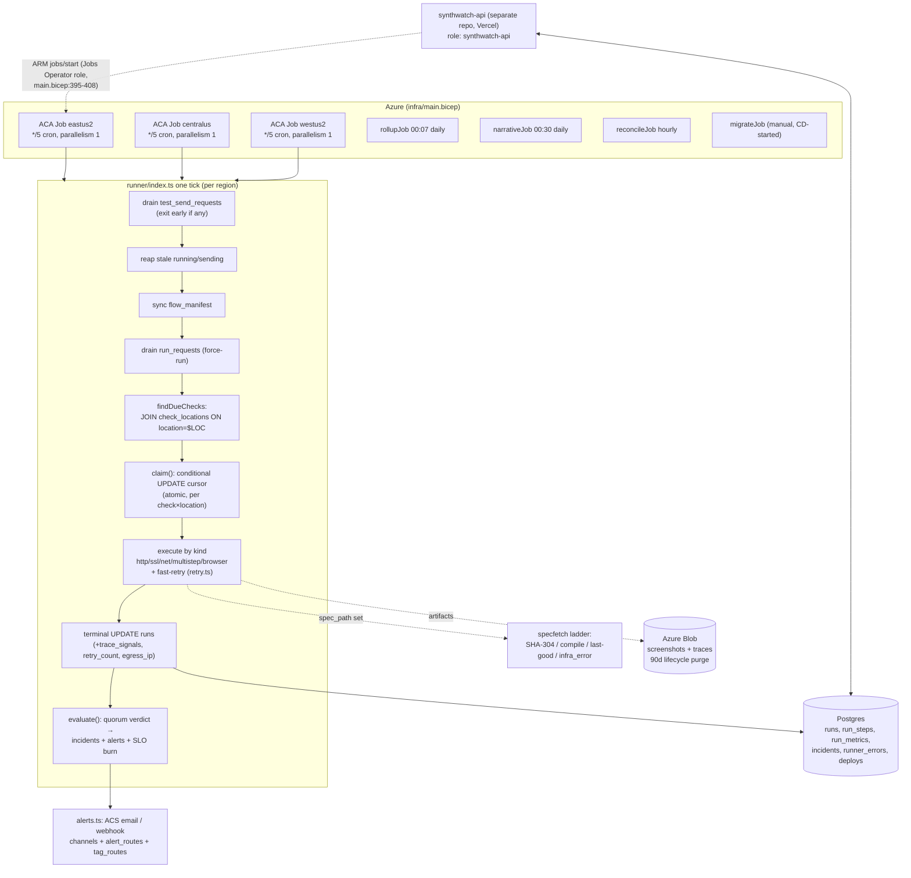

# SynthWatch Deep Review — July 2026 (docs-only analysis)

> **Status:** in progress (overnight run, sections committed incrementally).
> **Scope:** analysis only — no fixes applied. Every finding cites `file:line` or pasted
> command output. **OBSERVED** = ran it / read it here; **INFERRED** = deduced, with the
> falsification check named. Where a claim depends on external behavior (Node, Playwright,
> ACA, Postgres), it is verified against official docs, not memory, or listed in §7.
>
> **Recon result:** no prior committed analysis/review documents exist in this repo.
> `git log --all` shows prior sessions kept `ANALYSIS-*.md` as *gitignored scratch*
> (commit `1004396`, PR #174) — none were ever committed, so there is no baseline to
> diff against. This report is therefore a **fresh baseline**, not a NEW/CHANGED/STILL-OPEN
> delta. (OBSERVED: `.gitignore` ignores `ANALYSIS-*.md`; `git log --all --diff-filter=A`
> finds no `docs/analysis/**` history.)

## Contents

1. [System map as-observed](#1-system-map-as-observed)
2. [Schema stewardship audit](#2-schema-stewardship-audit)
3. [Code health](#3-code-health)
4. [Tech debt register](#4-tech-debt-register)
5. [Improvements + feature ideas](#5-improvements--feature-ideas)
6. [Boundary contracts](#6-boundary-contracts)
7. [Open questions + unverifiable](#7-open-questions--unverifiable)

---

## 1. System map as-observed

Everything in this section is **OBSERVED** from code/config in this repo unless marked otherwise.

### 1.1 Module structure

The repo has four functional areas (`README.md` + directory listing):

| Area | Contents | Evidence |
|---|---|---|
| `runner/` | The data-plane process (TypeScript, NodeNext ESM, Playwright). One entrypoint per concern: `index.ts` (check tick), `rollupMain.ts`, `narrativeMain.ts`, `reconcileMain.ts`, `redTestMain.ts` | `runner/package.json:11-18`; `runner/Dockerfile:28` (`CMD ["node","dist/index.js"]`) |
| `db/` | `schema.sql` (converged DDL), `migrations/0001…0057`, `migrate.sh`, `Dockerfile.migrate`, `ops/` (coordinated cutover scripts), `seed.sql` | `db/migrate.sh:1-24`; `db/Dockerfile.migrate:1-12` |
| `infra/` | One Bicep template declaring all Azure resources: 3 regional runner Jobs + migrate/rollup/narrative/reconcile Jobs, Postgres, Storage, Log Analytics, ACR, managed identity | `infra/main.bicep:444,609,765,902,970,1047,1153` |
| `scripts/` | `deploy.sh` (777-line manual deploy orchestrator) + `lib/deploy-lib.sh`, parity checkers, egress probe | `scripts/deploy.sh`, `scripts/lib/deploy-lib.sh` |

The dashboard/API is a **separate repo** (`synthwatch-api`, Next.js on Vercel — README "Decision 8"); it shares this repo's database. This repo owns the schema and all migrations (`.github/workflows/test.yml:6-8`: "The runner OWNS the schema + extraction logic + migrations — the most load-bearing repo").

### 1.2 Scheduler / dispatch flow (the three regional envs)

**Topology (OBSERVED from `infra/main.bicep`):** three identical ACA scheduled Jobs, one per region, all `cronExpression: '*/5 * * * *'`, `parallelism: 1`, `replicaTimeout: 240`, `replicaRetryLimit: 0` — primary eastus2 (`main.bicep:444-461`), centralus (`main.bicep:609-626`), westus2 (`main.bicep:765-782`). Each job differs only in region + `SYNTHWATCH_LOCATION` env (`main.bicep:525-526`). Regions were activated over time: `0014` (runs.location + min_fail_locations), `0020` (locations registry), `0022` (centralus cursors), `db/ops/relabel_default_to_eastus2.sql` (cutover relabel), `db/ops/assign_westus2_quorum.sql` (2-of-3 quorum activation; its comment says "Today all 9 checks are multi-region").

**Cadence lives in data, not cron** (README Decision 2): each check carries `interval_seconds` (default 300 — `db/schema.sql:66`) and a **per-(check, location) cursor** `check_locations.last_run_at`. The cron tier is just the finest tick.

**One tick's lifecycle** (`runner/index.ts:1-13` header, verified against the code):

1. **Test-send drain first** — API-triggered channel test-sends are DB rows; if any were processed the tick sends + exits, skipping checks (`index.ts:147-154`).
2. **Reap stale state** — `running` runs older than 30 min → `error` (`index.ts:200-211`), stale `sending` test-sends → `failed` (`index.ts:217-227`).
3. **Manifest sync** (best-effort, `index.ts:160`).
4. **On-demand "Run now" drain** — claims `run_requests` rows atomically (`UPDATE … WHERE status='pending'`, `index.ts:314-317`), dedups against an in-flight run (`index.ts:322-331`), force-claims and runs through the normal `runOne` path (`index.ts:333-355`).
5. **Due-filter** — `findDueChecks` INNER JOINs `check_locations` on `location = $SYNTHWATCH_LOCATION`: a check with no cursor for this region is *never selected* (enforced assignment, no lazy-insert — `index.ts:230-249`).
6. **Claim** — atomic conditional UPDATE of the (check_id, location) cursor, re-checking the due predicate; exactly one replica of one region wins; a `mirror` CTE keeps legacy `checks.last_run_at` in sync (`index.ts:262-284`).
7. **Execute** — by `check.kind`: http / ssl / dns / tcp / ping / multistep / browser (`index.ts:469-474`), wrapped in fast-retry (below).
8. **Evaluate** — cross-location verdict → debounced incidents → alerts → SLO burn check (`evaluate.ts:131-351`, `789-857`).

**Overlap / idempotency protection (OBSERVED):**
- Within a region: `parallelism: 1` (bicep) means overlapping replicas shouldn't occur; the conditional-UPDATE claim (`index.ts:262-284`) is the real guard and makes concurrent replicas race-safe anyway (README Decision 3).
- Across regions: cursors are keyed `(check_id, location)` (PK — `db/schema.sql:173-185`), so regions never contend.
- Incident open/resolve races across regions are handled by `ON CONFLICT (check_id) WHERE status='open' DO NOTHING` (`evaluate.ts:267-281`) and the conditional resolve UPDATE (`evaluate.ts:167-177`).
- A tick that overruns `replicaTimeout: 240`s is killed by ACA; the orphaned `running` row is reaped to `error` after 30 min (`index.ts:100-104, 200-211`), and `runOne` has a finalize-on-throw fallback (`index.ts:396-412`).

**Missed-tick behavior (OBSERVED + one INFERRED consequence):** the due predicate is age-based (`now() - last_run_at >= interval_seconds`), and claim sets the cursor to `now()`, not `last_run_at + interval` (`index.ts:266`). A missed/late ACA tick is simply absorbed: the check runs on the next tick, once — no backfill, no double-run. INFERRED consequence: the schedule is *drifting*, not fixed-rate — each late execution re-anchors the cadence (falsification check: read `claim()`; it sets `last_run_at = now()` unconditionally on win — confirmed). There is no drift test in the suite (searched `runner/*.test.ts`).

**Retry taxonomy (OBSERVED)** — five distinct mechanisms, in pipeline order (`db/migrations/0021_retries.sql:4-8`):

| # | Mechanism | Scope | Retries what | Evidence |
|---|---|---|---|---|
| 1 | Fast-retry (`runWithRetry`) | within one run | `error` AND `fail`; never pass/warn; fixed 5s backoff; last attempt is the verdict; prior attempt's run_steps/run_metrics/trace deleted between attempts; skipped when an incident is already open (`effectiveRetries`) | `retry.ts:16-50`; `index.ts:106-112, 450-490`; `0045` bumped default retries 1→2 |
| 2 | `failure_threshold` debounce + 2-of-3 quorum | across runs/locations | opens an incident only when ≥ effectiveN reporting locations each have their last N runs down; majority quorum `floor(n/2)+1` when `min_fail_locations` NULL | `evaluate.ts:387-446`; `quorum.test.ts:16-56`; `0045` defaulted threshold 3→1 |
| 3 | Spec-fetch fallback ladder | browser spec resolution | SHA-match reuse → recompile → last-known-good → non-paging `infra_error` (never throws into the run) | `specfetch/specCache.ts:138-192`; `index.ts:807-823` |
| 4 | Alert-level debounces | notifications | warn re-notify window (not stamped if ALL channels failed → retries next tick), RCA fire-once claim, SLO burn debounce | `evaluate.ts:532-580, 487-523, 789-857` |
| 5 | ACA replica retry | infra | `replicaRetryLimit: 0` for runner jobs (a crashed tick is just absorbed by the next cron); `1` for rollup/narrative/reconcile | `main.bicep:458,623,779,984,1061,1167` |

**Aux entrypoints (OBSERVED):** rollup daily 00:07 (`main.bicep:986`), narrative daily 00:30 (`main.bicep:1063`), reconcile hourly (`main.bicep:1169`) — all override the container CMD to their `dist/*Main.js`. `redTestMain.ts` is on-demand only, with **no ACA job resource** (grep of `main.bicep` — no match). The migrate job is `Manual`-trigger, run by CD before the image roll (`deploy.yml:79-110`) or by `scripts/deploy.sh:623,640`.

### 1.3 Config / secrets surface

Full inventory in the table below (every `process.env` read in `runner/`, cross-referenced with `infra/main.bicep` and `runner/.env.example`).

Secrets (bicep `secretRef`): `DATABASE_URL` (`db.ts:50`; bicep `:473,507`), `AZURE_STORAGE_CONNECTION_STRING` (`artifacts.ts:11`; bicep `:478`), `ACS_EMAIL_CONNECTION_STRING` (`alerts.ts:139`; bicep `:484,566`), `VERCEL_BYPASS_TOKEN` (`vercelBypass.ts:37`; bicep `:491,572` — host-scoped injection, deliberately not context-wide, `index.ts:850-867`). Non-secret env: `SYNTHWATCH_LOCATION`, `AZURE_OPENAI_*`, `AZURE_CLIENT_ID`, `ALERT_EMAIL_FROM`, `AZURE_STORAGE_CONTAINER`, `RCA_MAX_TOKENS`.

Findings (all OBSERVED):
- **Dead documented config:** `.env.example` documents `ALERT_EMAIL_TO` (`:21`), `ALERT_WEBHOOK_URL` (`:29`), `ALERT_WEBHOOK_AUTH_HEADER` (`:31`) — none is read anywhere; recipients/URLs now come from DB channel config (`alerts.ts:141,161,164`). Setting them silently does nothing.
- **Undocumented live config:** `SYNTHWATCH_LOCATION` (`index.ts:123`), `ALERT_TIMEOUT_MS` (`alerts.ts:26`), all `RCA_*` (`rca.ts:20-37`), `GITHUB_TOKEN`/`SYNTHWATCH_MONITORS_TOKEN` (`specfetch/fetchSpec.ts:42`), all `OTEL_*` (`otel.ts:74-84`) are absent from `.env.example`.
- **Template-unowned env:** `DASHBOARD_URL`, `ALERT_WEBHOOK_*`, `OTEL_*` are explicitly not bicep-owned (`main.bicep:575-578`) — a redeploy does not restore them (acknowledged in-template).
- **Deploy-time secrets** come from `~/.synthwatch.env` on the operator's machine (`scripts/deploy.sh:147-152`), passed inline as bicep params; the GitHub Actions deploy uses OIDC only, no DB password in CI (`deploy.yml:48-50, 76-78`).
- **Possible log leak (minor):** `otel.ts:92,135` logs the raw `OTEL_EXPORTER_OTLP_ENDPOINT`; a token embedded in that URL would land in ACA logs. `OTEL_EXPORTER_OTLP_HEADERS` (auth-bearing) is consumed implicitly by the SDK (`otel.ts:84` comment) and so escapes any env-var audit by grep.

### 1.4 Logging / telemetry paths

Four sinks (all OBSERVED):

1. **stdout → ACA Log Analytics.** ~20 bracketed channels (`[runner]`, `[trace]`, `[specfetch]`, `[metrics]`, `[rca]`, `[alerts]`, `[reconcile]`, …). Every invocation stamps a per-process `INVOCATION_ID` UUID on its first line (`index.ts:134`; `runnerErrors.ts:14-19`) so stdout ↔ DB rows reconcile.
2. **`runner_errors` table** (queryable fatal sink, migration 0050): `recordFatal(phase, err)` writes `{invocation_id, phase, check_id, run_id, message, stack}` best-effort with a 5s time-bound (`runnerErrors.ts:48-76`); global uncaught/unhandled handlers preserve exit-1 semantics (`runnerErrors.ts:83-90`; installed `index.ts:1023`). Phases in code: `main`, `due-loop`, `on-demand-loop`, `uncaughtException`, `unhandledRejection` (+ `deploy-marker` writes via `deploys.ts`). Note: 0050's comment documents only three of these.
3. **OTel side-channel** (opt-in): OTLP traces (root span per run + child span per step) and metrics (duration histogram, runs counter, up/down counter with bounded label set; `infra_error` excluded from up/down) — `otel.ts:195-287`; emitted after the run is already persisted (`index.ts:640-689`); shutdown flush bounded to 5s (`otel.ts:291-304`).
4. **Egress-IP capture** (static-egress-IP Phase 0): once per process, warmed at startup (`index.ts:137-138`), reflector list `checkip.amazonaws.com` → `api.ipify.org`, 3s timeout each, strict IP-shape validation, never throws → null (`egress.ts:14-45`); memoized incl. failure (`egress.ts:48-76`); stamped raw (deliberately not through the redactor — "our own infra's public IP", `index.ts:586-589`) into `runs.egress_ip` (migration 0054).

**Redaction application map** (who scrubs vs writes raw) — full analysis in §3.4; summary: scrubbing is a *sensitive-monitor-only* concern applied at `runs.error_message`, `run_steps.error_message` (both browser + multistep paths), and `trace_signals`; `runner_errors` and non-sensitive monitors persist raw text by design.

## 2. Schema stewardship audit

*(pending)*

## 3. Code health

*(pending)*

## 4. Tech debt register

*(pending)*

## 5. Improvements + feature ideas

*(pending)*

## 6. Boundary contracts

*(pending)*

## 7. Open questions + unverifiable

*(pending)*
